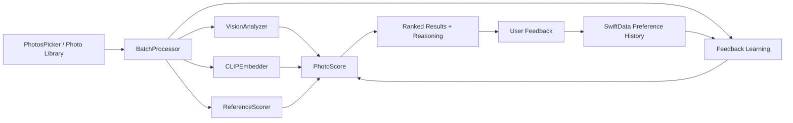

<p align="center">
  
</p>

<h1 align="center">Vesper</h1>

<p align="center">
  Native iOS photo curation powered by on-device Vision, Core ML, CLIP embeddings, and preference learning.
</p>

<p align="center">
  
  
  
  
</p>

Vesper is a native iOS photo curation app that helps people find the best shots from a batch of similar photos. Users import a set of images, choose what they are optimizing for, and Vesper ranks the photos with plain-English reasoning so they do not have to manually compare dozens of near-duplicates.

The app is built around a simple product idea: photo selection is personal. A technically sharp photo is not always the best photo, and a photo with an imperfection can still be the right pick if the expression, angle, composition, and user preference all support it.

## Highlights

- Native SwiftUI app with SwiftData persistence
- On-device photo analysis with Apple Vision and Core ML
- CLIP-based image and text embeddings for prompt matching, aesthetic scoring, and reference-photo similarity
- User preference learning from Like, OK, and Dislike feedback
- Reference-photo profile that can learn a user's visual taste and help identify the recurring user face in future batches
- Batch ranking for dating photos, social posts, professional shots, outfit checks, and camera roll cleanup
- Full library cleanup flow with review-first delete suggestions
- Firebase App Check and locked-down Firestore rules for optional anonymous feedback collection

## Product Flow

1. Choose a goal, such as dating profile, Instagram post, professional headshots, outfit check, or cleanup.
2. Import a batch of similar photos.
3. Vesper scores each image using visual quality, faces, eye state, expression, pose, composition, color, reference similarity, and prompt intent.
4. Results are ranked with readable explanations.
5. The user rates photos as Like, OK, or Dislike. Those signals update the local preference profile for future batches.

## AI and Scoring

Vesper does not upload photos to a hosted AI API for ranking. The core scoring pipeline runs locally and combines several signals:

| Signal | Purpose |
| --- | --- |
| Vision analysis | Face detection, eye state, gaze, pose, composition, and basic quality signals |
| CLIP image embeddings | Similarity between photos, reference style matching, and semantic scoring |
| CLIP text embeddings | Prompt-mode matching and dislike-reason interpretation |
| Reference photos | Personal style profile and recurring-face identity anchors |
| Feedback history | Local preference adaptation based on what the user likes, dislikes, or marks OK |
| Cleanup heuristics | Conservative delete candidates for blurry, duplicate, or weak photos |

The preference system uses Bayesian shrinkage so early feedback matters without overfitting. A single dislike can nudge a dimension, but repeated feedback is required before Vesper becomes confident. This is especially important for subjective cases like closed eyes: Vesper can learn that a user likes intentional closed-eye photos when expression, angle, and framing are strong, while still treating disliked closed-eye photos as a negative signal.

## Privacy Model

Vesper is designed around local-first photo analysis:

- Photo ranking runs on device.
- Reference photos are stored locally with SwiftData.
- Feedback learning runs from local history.
- Full-resolution photos are not uploaded for scoring.
- Optional anonymous feedback can be sent to Firebase only after the user opts in.
- Optional shared thumbnails are resized and capped before upload.
- Firestore rules deny reads, deny updates/deletes, require App Check, validate field types, and cap payload sizes.

Firebase configuration files are intentionally not committed. Add your own `Vesper/GoogleService-Info.plist` when running the project locally.

## Technical Architecture



### Key Modules

| Area | Files |
| --- | --- |
| App entry and persistence | `Vesper/VesperApp.swift`, `Vesper/Models/VesperSchema.swift` |
| Batch scoring | `Vesper/Services/BatchProcessor.swift` |
| Vision features | `Vesper/ML/VisionAnalyzer.swift` |
| CLIP embeddings | `Vesper/ML/CLIPEmbedder.swift`, `Vesper/ML/CLIPTextEmbedder.swift`, `Vesper/ML/CLIPTokenizer.swift` |
| Reference style and identity | `Vesper/Services/ReferencePhotoService.swift`, `Vesper/ML/ReferenceScorer.swift` |
| Feedback learning | `Vesper/Models/PhotoFeedback.swift`, `Vesper/Features/Training/AITrainingView.swift` |
| Results and feedback UI | `Vesper/Features/Results/ResultsView.swift` |
| Cleanup | `Vesper/Features/CleanUp/` |
| Security rules | `firestore.rules` |

## Testing

The test suite covers scoring behavior, calibration, startup, gaze detection, eye aspect ratio, reference-photo identity, near-duplicate handling, and product personas.

Run unit tests:

```bash
xcodebuild test \
  -project Vesper.xcodeproj \
  -scheme Vesper \
  -destination 'platform=iOS Simulator,name=iPhone 17,OS=26.5' \
  -only-testing:VesperTests
```

Run a simulator build:

```bash
xcodebuild build \
  -project Vesper.xcodeproj \
  -scheme Vesper \
  -destination 'platform=iOS Simulator,name=iPhone 17,OS=26.5'
```

## Running Locally

Requirements:

- Xcode
- iOS 17.6 or later
- iOS Simulator or a physical iPhone
- Firebase project configuration if using Remote Config, App Check, or feedback upload
- Core ML model assets required by the CLIP embedding pipeline

Setup:

1. Clone the repository.
2. Add your Firebase config at `Vesper/GoogleService-Info.plist`.
3. Open `Vesper.xcodeproj` in Xcode.
4. Select the `Vesper` scheme.
5. Build and run on a simulator or physical device.

## Engineering Notes

- The app limits concurrent analysis work so Vision and Core ML do not overwhelm the device.
- Startup avoids eager model loading where possible, improving perceived launch speed.
- SwiftData migrations use versioned schemas and defensive startup recovery.
- User-facing scoring explanations are generated from the same signals used for ranking.
- Cleanup suggestions are review-first; the app does not silently delete photos.
- Remote Config values are clamped before use so unsafe scoring values cannot dominate ranking.

## Status

Vesper is in active development. It is built as a real native app with local AI scoring, persistence, feedback learning, and security hardening, but it is not presented here as a finished App Store release.
